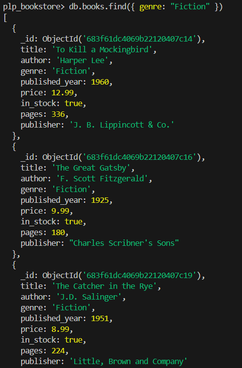
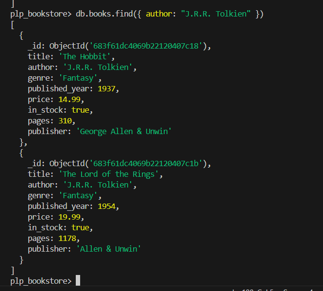
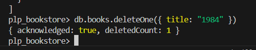
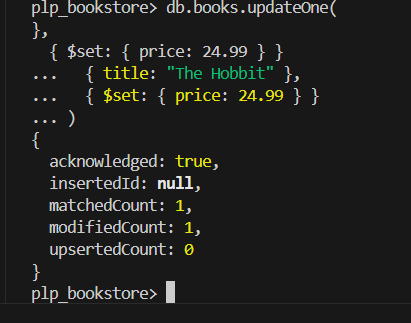

# MongoDB Fundamentals Assignment

## Overview
This project demonstrates foundational MongoDB skills, including:
- CRUD operations
- Advanced queries
- Aggregation pipelines
- Indexing and performance analysis

All tasks are performed using a sample `plp_bookstore` database.

---

## Prerequisites

- MongoDB (local installation or [MongoDB Atlas](https://www.mongodb.com/cloud/atlas))
- Node.js v16+ (recommended: v20)
- `mongosh` (MongoDB shell)

---

## Setup Instructions

### Step 1: Insert Sample Data

```bash
mongosh insert_books.js
````

✅ This script will:

* Create the `plp_bookstore` database
* Populate the `books` collection with sample data
* Log all inserted documents

### Step 2: Run Queries

```bash
mongosh < queries.js
```

✅ This will:

* Run all CRUD, advanced, and aggregation queries
* Log results directly in the terminal

---

## 📝 Tasks Overview

### ✅ Task 1: MongoDB Setup

* Created `plp_bookstore` database
* Inserted 12 sample book documents into `books` collection

### ✅ Task 2: Basic CRUD Operations

| Operation      | Example Command                                                           |
| -------------- | ------------------------------------------------------------------------- |
| Find by Genre  | `db.books.find({ genre: "Fiction" })`                                     |
| Find by Year   | `db.books.find({ published_year: { $gt: 1950 } })`                        |
| Find by Author | `db.books.find({ author: "J.R.R. Tolkien" })`                             |
| Update Price   | `db.books.updateOne({ title: "The Hobbit" }, { $set: { price: 24.99 } })` |
| Delete Book    | `db.books.deleteOne({ title: "1984" })`                                   |

📸 Screenshots:

* 
* 
* 
* 
* 

### ✅ Task 3: Advanced Queries

* Find books in stock after 2010
* Projection (only title, author, price)
* Sorting by price (asc/desc)
* Pagination (5 books per page)

### ✅ Task 4: Aggregation Pipelines

* Average price by genre
```bash
db.books.aggregate([
  {
    $group: {
      _id: "$genre",
      averagePrice: { $avg: "$price" }
    }
  },
  {
    $sort: { averagePrice: -1 }
  }
])
```
* Author with most books
```bash
db.books.aggregate([
  {
    $group: {
      _id: "$author",
      count: { $sum: 1 }
    }
  },
  {
    $sort: { count: -1 }
  },
  {
    $limit: 1
  }
])
```
* Group by publication decade
```bash
db.books.aggregate([
  {
    $project: {
      title: 1,
      decade: {
        $concat: [
          { $substr: [{ $multiply: [{ $floor: { $divide: ["$published_year", 10] } }, 10] }, 0, 4] },
          "s"
        ]
      }
    }
  },
  {
    $group: {
      _id: "$decade",
      count: { $sum: 1 }
    }
  },
  {
    $sort: { _id: 1 }
  }
])

```


### ✅ Task 5: Indexing

* Created single index: `title`
```bash
db.books.createIndex({ title: 1 })
```
* Created compound index: `{ author, published_year }`
```bash
db.books.createIndex({ author: 1, published_year: 1 })
```
* Used `.explain()` to demonstrate performance
```bash
db.books.find({ author: "J.R.R. Tolkien" }).explain()
```

---

## 🔍 Verification

To manually inspect the data:

```bash
mongosh
use plp_bookstore
db.books.find().pretty()
```

---

## ✅ Assignment Checklist

* [x] MongoDB setup and data insertion
* [x] Basic CRUD operations
* [x] Advanced queries with projection/sorting
* [x] Aggregation pipelines
* [x] Index creation & performance comparison
* [x] Documentation with screenshots

---

## ⚠️ Troubleshooting

| Issue                 | Fix                                                   |
| --------------------- | ----------------------------------------------------- |
| MongoDB not running   | Start MongoDB using `mongod`                          |
| Node script fails     | Ensure you're using Node.js v16+                      |
| Can't connect to DB   | Check the connection string in `insert_books.js`      |
| Screenshots not found | Make sure they're placed in the `screenshots/` folder |

---

## 📄 License

This project is submitted as part of the **PLP MERN Stack Development** coursework.

